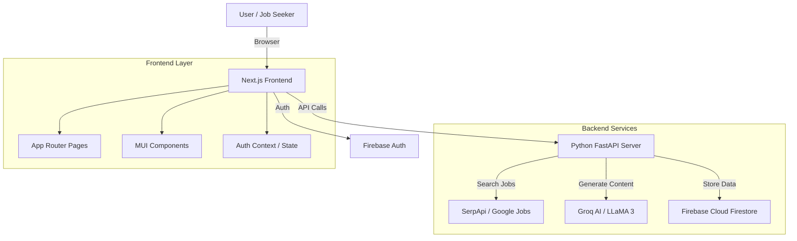

# NorthStar Works - Architecture Documentation

## Executive Summary

**NorthStar Works** is a unified digital platform designed to support Minnesotans through career transitions. It combines efficient **Unemployment Insurance (UI)** management with powerful, AI-driven **Job Search** capabilities. The goal is to reduce the friction between losing a job and finding the next one.

## System Architecture

### High-Level Overview

The application follows a **Hybrid Architecture** leveraging the best of **Next.js** for frontend performance and **Python (FastAPI)** for backend logic and data science/AI capabilities.



### Technology Stack

| Layer          | Technology            | Purpose                                         |
| -------------- | --------------------- | ----------------------------------------------- |
| **Frontend**   | Next.js 16 (React 19) | Application framework, SSR, Routing             |
| **UI Library** | Material UI (MUI) v6  | Component primitives, Design System             |
| **Styling**    | Tailwind CSS v4       | Utility-first styling for layout                |
| **Backend**    | Python FastAPI        | API Endpoints, Business Logic, AI Orchestration |
| **Database**   | Firebase Firestore    | NoSQL Application Data (Applications, Messages) |
| **Auth**       | Firebase Auth         | User authentication (Google, Email)             |
| **AI/LLM**     | Groq (Llama 3.3 70b)  | Resume parsing, Cover letter generation, Chat   |

## Data Flow Architecture

### 1. Job Search Pipeline

The job search functionality handles real-time data fetching from Google Jobs via SerpApi.

1. **User** initiates search with keywords/location.
2. **Frontend** sends request to `/api/v1/search`.
3. **Backend** constructs SerpApi query with specific filters (Remote, Date Posted).
4. **Backend** parses raw results, standardizes data structure, and calculates "Freshness Score" and "Highlights".
5. **Frontend** receives JSON and renders `JobCards`.

### 2. AI Content Generation

We use **Groq** for high-speed LLM inference.

1. **Resume Analysis**: PDF parsing via `pypdf` -> Text extraction -> LLM Analysis.
2. **Follow-Up Emails**: User selection -> Template Context -> LLM Generation -> JSON Response.

### 3. Application Tracking

Data persistence is handled via Firestore.

- **Applications** are stored in the `applications` collection.
- **Work Search Logs** are linked to User IDs.
- **Security**: Backend validates inputs before writing to Firestore (using Admin SDK).

## Directory Structure

```
/
├── api/                    # Python Backend
│   ├── index.py           # Main FastAPI entrypoint
│   └── requirements.txt   # Python dependencies
├── src/
│   ├── app/               # Next.js App Router (Pages)
│   │   ├── work-search/   # Job Search Page
│   │   ├── dashboard/     # User Dashboard
│   │   └── api/           # Next.js API Routes (proxies if needed)
│   ├── components/        # Reusable UI Components
│   ├── lib/               # Utilities & Services
│   │   ├── firebase.ts    # Firebase Client Config
│   │   ├── linkedin.ts    # Job Data Types & Service
│   │   └── auth.tsx       # Authentication Context
│   └── types/             # TypeScript Definitions
├── public/                # Static Assets
└── package.json           # Node Dependencies
```

## Security Considerations

- **API Keys**: All sensitive keys (SerpApi, Groq, Firebase Admin) are stored in server-side Environment Variables.
- **Validation**: Pydantic models in FastAPI ensure strict request validation.
- **Auth**: Client-side tokens are verified against Firebase.

## Future Roadmap

- **Real-time Notifications**: Implement Firebase Cloud Messaging.
- **Resume Hosting**: Secure PDF storage in Firebase Storage.
- **Employer Portal**: Separate views for employers to post jobs directly.
