# NorthStar Works - Detailed Architecture Diagrams

This document provides comprehensive visual representations of the system architecture.

---

## 1. System Architecture Overview

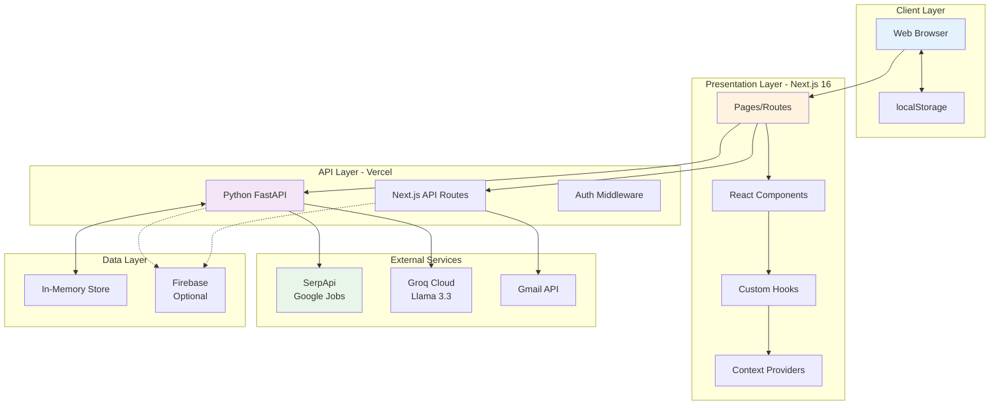

---

## 2. Request Flow - Job Search

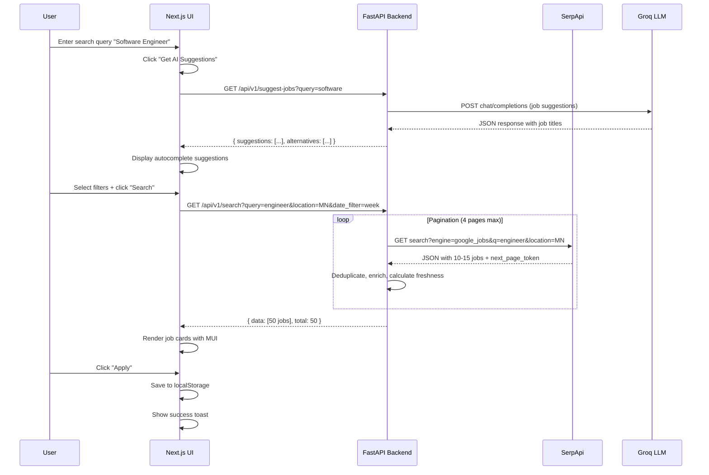

---

## 3. Request Flow - AI Follow-Up Email

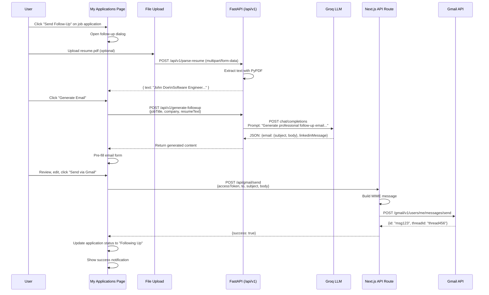

---

## 4. Data Flow - Hybrid Storage Architecture

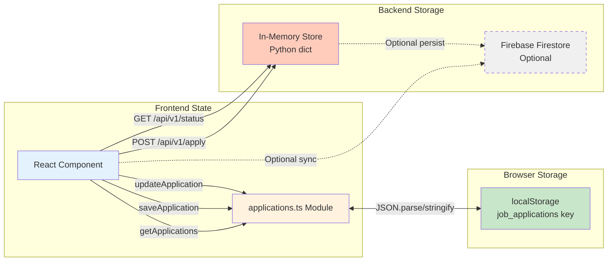

---

## 5. Component Hierarchy - Frontend Architecture

```mermaid
graph TD
    RootLayout[layout.tsx<br/>Root Layout]
    
    RootLayout --> ThemeReg[ThemeRegistry<br/>MUI Theme Provider]
    RootLayout --> NextAuthProv[NextAuth SessionProvider]
    RootLayout --> AuthProv[Custom AuthProvider<br/>Firebase Context]
    RootLayout --> NavBar[NavBar Component]
    
    RootLayout --> Pages[Page Routes]
    
    Pages --> Home[/ - Landing Page]
    Pages --> Dashboard[/dashboard]
    Pages --> JobSearch[/work-search]
    Pages --> MyApps[/my-applications]
    Pages --> Apply[/apply]
    Pages --> Eligibility[/eligibility]
    Pages --> Admin[/admin]
    Pages --> Weekly[/weekly-request]
    Pages --> Community[/community]
    
    JobSearch --> JobCard[JobCard Component]
    JobSearch --> SearchFilters[Filter Chips]
    JobSearch --> Autocomplete[MUI Autocomplete]
    
    MyApps --> AppCard[ApplicationCard]
    MyApps --> StatusChip[Status Chip]
    MyApps --> FollowUpDialog[Follow-Up Dialog]
    
    Dashboard --> StatusTracker[Progress Tracker]
    Dashboard --> NotificationList[Notification List]
    Dashboard --> WorkLog[Work Log]
    
    NavBar --> AuthBtn[Login/Logout Button]
    NavBar --> NavLinks[Navigation Links]
    
    Community --> ChatRoom[ChatRoom Component<br/>Real-time chat]
    
    style RootLayout fill:#3f51b5,color:#fff
    style Pages fill:#ff9800,color:#fff
    style JobSearch fill:#4caf50,color:#fff
    style MyApps fill:#e91e63,color:#fff
```

---

## 6. API Endpoint Map

```mermaid
graph TB
    Client[Client Requests]
    
    subgraph "Next.js API Routes (/api)"
        AuthRoute[/api/auth/[...nextauth]<br/>NextAuth.js OAuth]
        GmailRoute[/api/gmail/send<br/>Email Sending]
    end
    
    subgraph "FastAPI Routes (/api/v1)"
        SearchEP[GET /search<br/>Job Search]
        SuggestEP[GET /suggest-jobs<br/>AI Suggestions]
        FollowupEP[POST /generate-followup<br/>Email Generation]
        ParseEP[POST /parse-resume<br/>PDF Parsing]
        ContactEP[GET /find-contact<br/>LinkedIn Search]
        ApplyEP[POST /apply<br/>Submit Application]
        StatusEP[GET /status<br/>Get Status]
        WorkLogEP[POST /work-log<br/>Log Job Activity]
        AdminGET[GET /admin<br/>List Apps]
        AdminPATCH[PATCH /admin<br/>Update Status]
        ChatEP[POST /ai/chat-assist<br/>AI Chat]
    end
    
    Client --> AuthRoute
    Client --> GmailRoute
    Client --> SearchEP
    Client --> SuggestEP
    Client --> FollowupEP
    Client --> ParseEP
    Client --> ContactEP
    Client --> ApplyEP
    Client --> StatusEP
    Client --> WorkLogEP
    Client --> AdminGET
    Client --> AdminPATCH
    Client --> ChatEP
    
    SearchEP -.->|SerpApi| ExtAPI[External APIs]
    SuggestEP -.->|Groq| ExtAPI
    FollowupEP -.->|Groq| ExtAPI
    ContactEP -.->|SerpApi| ExtAPI
    GmailRoute -.->|Gmail API| ExtAPI
    
    style AuthRoute fill:#4caf50
    style GmailRoute fill:#4caf50
    style SearchEP fill:#2196f3
    style SuggestEP fill:#9c27b0
    style FollowupEP fill:#9c27b0
    style ChatEP fill:#9c27b0
```

---

## 7. Authentication Flow - Google OAuth

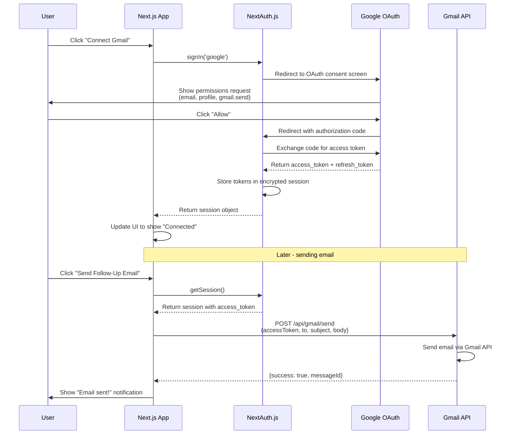

---

## 8. Deployment Architecture - Vercel

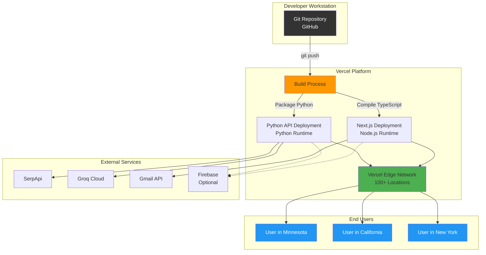

---

## 9. State Management Flow

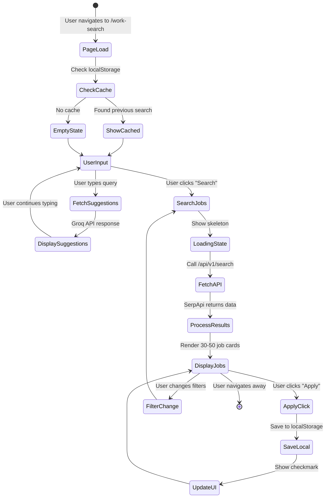

---

## 10. Error Handling & Fallback Strategy

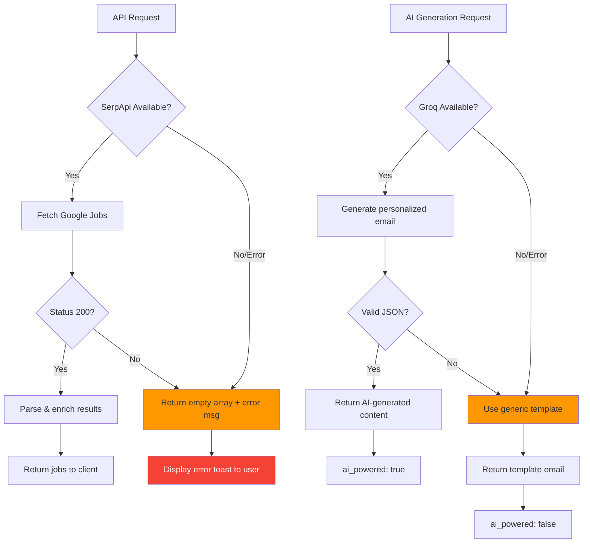

---

## 11. Job Application Lifecycle

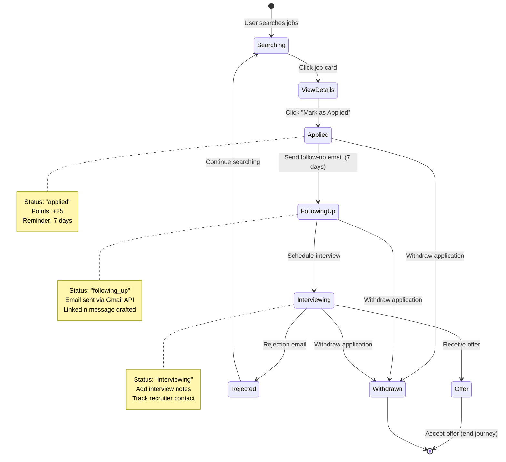

---

## 12. Firebase Integration (Optional)

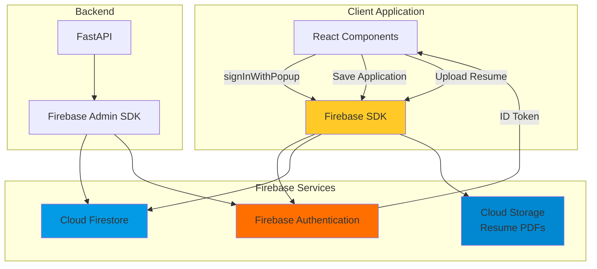

---

## 13. Performance Optimization Strategy

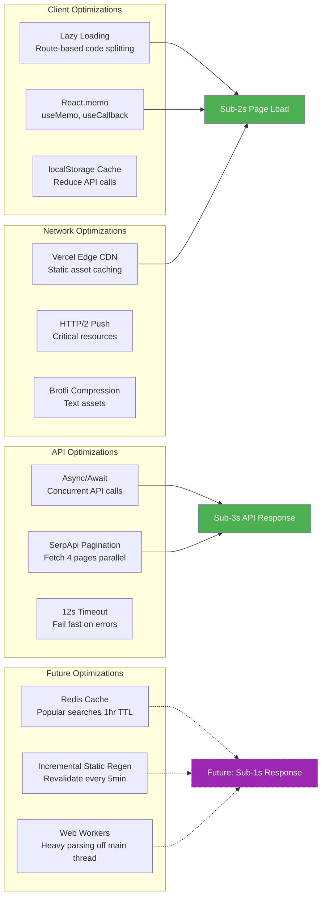

---

## 14. Security Layers

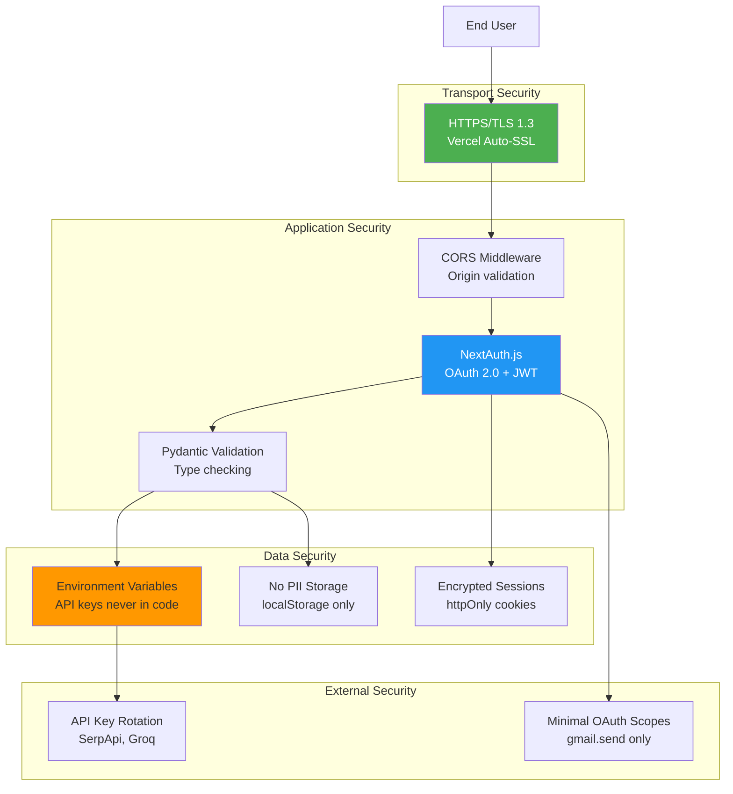

---

## 15. Scalability Roadmap

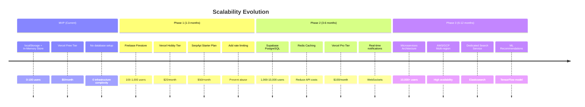

---

## Legend

**Diagram Symbols**:
- Solid lines (→): Active data flow
- Dashed lines (⇢): Optional/future feature
- Subgraphs: Logical grouping of components
- Colors:
  - 🔵 Blue: Frontend/Client
  - 🟠 Orange: Build/Process
  - 🟣 Purple: AI/ML Services
  - 🟢 Green: External APIs
  - 🔴 Red: Error states

**Mermaid Rendering**:
These diagrams are written in Mermaid syntax and can be rendered in:
- GitHub (native support)
- VS Code (Mermaid Preview extension)
- Mermaid Live Editor (https://mermaid.live)
- Documentation sites (Docusaurus, MkDocs)

---

**Last Updated**: January 22, 2026

