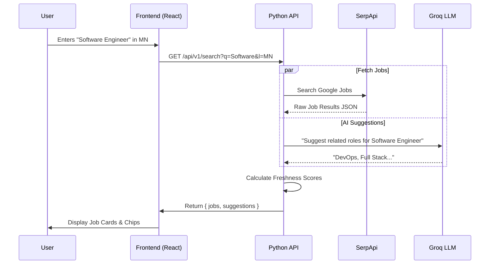
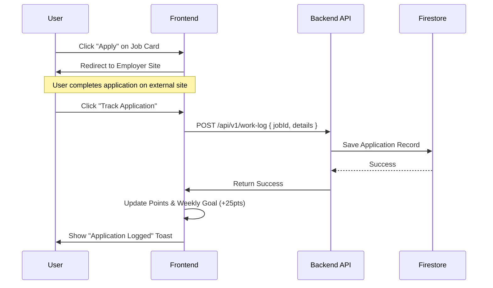
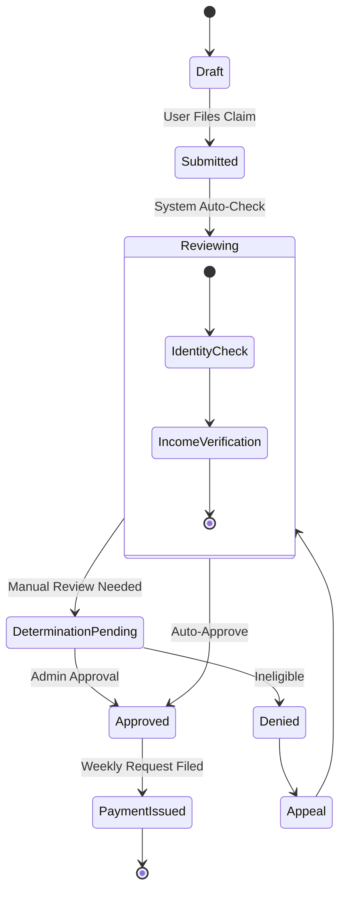
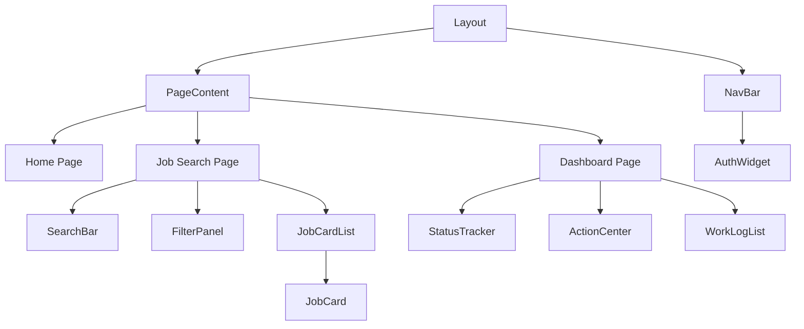

# System Diagrams

## 1. System Context Diagram

High-level view of how users interact with the NorthStar Works platform and external systems.

```mermaid
graph TB
    User[Job Seeker / Claimant]

    subgraph "NorthStar Works Platform"
        WebApp[Next.js Web Application]
        API[FastAPI Backend Service]
        DB[(Firebase Firestore)]
    end

    subgraph "External Systems"
        Google[Google Jobs (SerpApi)]
        Groq[Groq AI Platform]
        AuthService[Firebase Auth]
    end

    User -->|Uses| WebApp
    WebApp -->|Authenticates| AuthService
    WebApp -->|API Requests| API

    API -->|Fetch Jobs| Google
    API -->|Generate Content| Groq
    API -->|Read/Write| DB
```

## 2. Job Search Sequence

How a user searches for jobs and gets AI-enhanced results.



## 3. Application Submission Flow

The process of logging a work search activity / application.



## 4. Application Status State Machine

The lifecycle of an Unemployment Insurance application within the system.



## 5. Component Hierarchy (Simplified)


